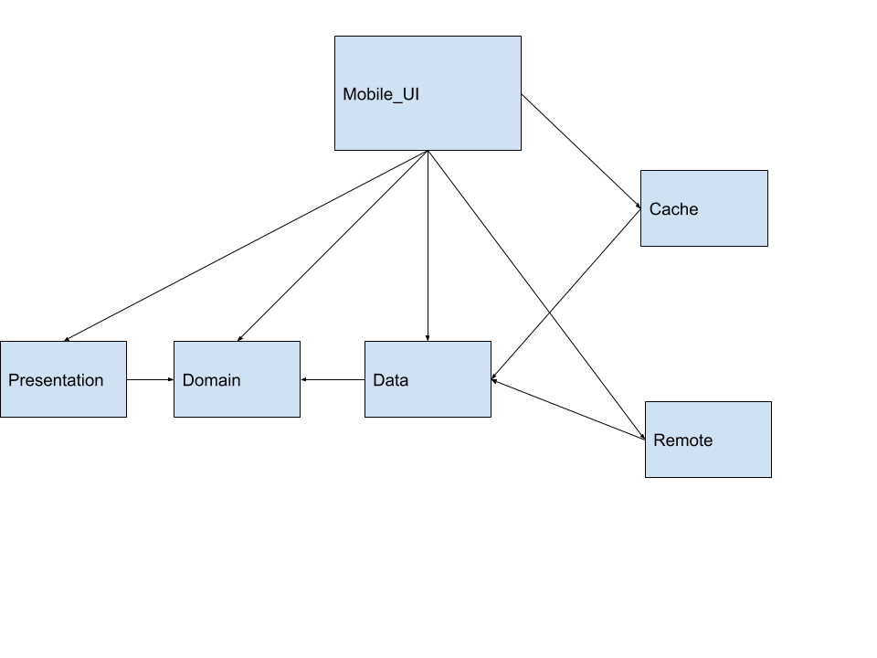

# clean-architecture-demo

Each layer contains it’s own model representation, this helps us remove the dependencies on other modules
An inner layer will provide the interface with the operations that must be implemented and the implementation of that interface will be provided by an outside layer

The benefits of using clean architecture
- Clear separation of concerns between responsibilities
- Decoupled responsibilities reduces frictions between teams
- Easier to maintain, navigate and extend on implementations
- Code becomes more testable, tests follow the same practices
- Makes sense for larger more complex projects
- But can apply simplified version of concepts to smaller projects

